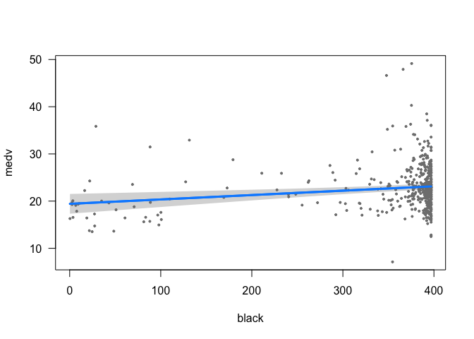

Collaborators:
--------------

Nikhil Samtani, Neha Pothina

1. Housing Values in Suburbs of Boston
--------------------------------------

In this problem I am using the Boston dataset that is available in
*MASS* package. This dataset contains information about median house
value for 506 neighborhoods in Boston, MA.

    library(MASS)
    Boston_housing_data <- Boston

### 1.1 Describe data

    head(Boston_housing_data)

    ##      crim zn indus chas   nox    rm  age    dis rad tax ptratio  black
    ## 1 0.00632 18  2.31    0 0.538 6.575 65.2 4.0900   1 296    15.3 396.90
    ## 2 0.02731  0  7.07    0 0.469 6.421 78.9 4.9671   2 242    17.8 396.90
    ## 3 0.02729  0  7.07    0 0.469 7.185 61.1 4.9671   2 242    17.8 392.83
    ## 4 0.03237  0  2.18    0 0.458 6.998 45.8 6.0622   3 222    18.7 394.63
    ## 5 0.06905  0  2.18    0 0.458 7.147 54.2 6.0622   3 222    18.7 396.90
    ## 6 0.02985  0  2.18    0 0.458 6.430 58.7 6.0622   3 222    18.7 394.12
    ##   lstat medv
    ## 1  4.98 24.0
    ## 2  9.14 21.6
    ## 3  4.03 34.7
    ## 4  2.94 33.4
    ## 5  5.33 36.2
    ## 6  5.21 28.7

    tail(Boston_housing_data)

    ##        crim zn indus chas   nox    rm  age    dis rad tax ptratio  black
    ## 501 0.22438  0  9.69    0 0.585 6.027 79.7 2.4982   6 391    19.2 396.90
    ## 502 0.06263  0 11.93    0 0.573 6.593 69.1 2.4786   1 273    21.0 391.99
    ## 503 0.04527  0 11.93    0 0.573 6.120 76.7 2.2875   1 273    21.0 396.90
    ## 504 0.06076  0 11.93    0 0.573 6.976 91.0 2.1675   1 273    21.0 396.90
    ## 505 0.10959  0 11.93    0 0.573 6.794 89.3 2.3889   1 273    21.0 393.45
    ## 506 0.04741  0 11.93    0 0.573 6.030 80.8 2.5050   1 273    21.0 396.90
    ##     lstat medv
    ## 501 14.33 16.8
    ## 502  9.67 22.4
    ## 503  9.08 20.6
    ## 504  5.64 23.9
    ## 505  6.48 22.0
    ## 506  7.88 11.9

    head(Boston_housing_data)

    ##      crim zn indus chas   nox    rm  age    dis rad tax ptratio  black
    ## 1 0.00632 18  2.31    0 0.538 6.575 65.2 4.0900   1 296    15.3 396.90
    ## 2 0.02731  0  7.07    0 0.469 6.421 78.9 4.9671   2 242    17.8 396.90
    ## 3 0.02729  0  7.07    0 0.469 7.185 61.1 4.9671   2 242    17.8 392.83
    ## 4 0.03237  0  2.18    0 0.458 6.998 45.8 6.0622   3 222    18.7 394.63
    ## 5 0.06905  0  2.18    0 0.458 7.147 54.2 6.0622   3 222    18.7 396.90
    ## 6 0.02985  0  2.18    0 0.458 6.430 58.7 6.0622   3 222    18.7 394.12
    ##   lstat medv
    ## 1  4.98 24.0
    ## 2  9.14 21.6
    ## 3  4.03 34.7
    ## 4  2.94 33.4
    ## 5  5.33 36.2
    ## 6  5.21 28.7

    str(Boston_housing_data)

    ## 'data.frame':    506 obs. of  14 variables:
    ##  $ crim   : num  0.00632 0.02731 0.02729 0.03237 0.06905 ...
    ##  $ zn     : num  18 0 0 0 0 0 12.5 12.5 12.5 12.5 ...
    ##  $ indus  : num  2.31 7.07 7.07 2.18 2.18 2.18 7.87 7.87 7.87 7.87 ...
    ##  $ chas   : int  0 0 0 0 0 0 0 0 0 0 ...
    ##  $ nox    : num  0.538 0.469 0.469 0.458 0.458 0.458 0.524 0.524 0.524 0.524 ...
    ##  $ rm     : num  6.58 6.42 7.18 7 7.15 ...
    ##  $ age    : num  65.2 78.9 61.1 45.8 54.2 58.7 66.6 96.1 100 85.9 ...
    ##  $ dis    : num  4.09 4.97 4.97 6.06 6.06 ...
    ##  $ rad    : int  1 2 2 3 3 3 5 5 5 5 ...
    ##  $ tax    : num  296 242 242 222 222 222 311 311 311 311 ...
    ##  $ ptratio: num  15.3 17.8 17.8 18.7 18.7 18.7 15.2 15.2 15.2 15.2 ...
    ##  $ black  : num  397 397 393 395 397 ...
    ##  $ lstat  : num  4.98 9.14 4.03 2.94 5.33 ...
    ##  $ medv   : num  24 21.6 34.7 33.4 36.2 28.7 22.9 27.1 16.5 18.9 ...

    summary(Boston_housing_data)

    ##       crim                zn             indus            chas        
    ##  Min.   : 0.00632   Min.   :  0.00   Min.   : 0.46   Min.   :0.00000  
    ##  1st Qu.: 0.08204   1st Qu.:  0.00   1st Qu.: 5.19   1st Qu.:0.00000  
    ##  Median : 0.25651   Median :  0.00   Median : 9.69   Median :0.00000  
    ##  Mean   : 3.61352   Mean   : 11.36   Mean   :11.14   Mean   :0.06917  
    ##  3rd Qu.: 3.67708   3rd Qu.: 12.50   3rd Qu.:18.10   3rd Qu.:0.00000  
    ##  Max.   :88.97620   Max.   :100.00   Max.   :27.74   Max.   :1.00000  
    ##       nox               rm             age              dis        
    ##  Min.   :0.3850   Min.   :3.561   Min.   :  2.90   Min.   : 1.130  
    ##  1st Qu.:0.4490   1st Qu.:5.886   1st Qu.: 45.02   1st Qu.: 2.100  
    ##  Median :0.5380   Median :6.208   Median : 77.50   Median : 3.207  
    ##  Mean   :0.5547   Mean   :6.285   Mean   : 68.57   Mean   : 3.795  
    ##  3rd Qu.:0.6240   3rd Qu.:6.623   3rd Qu.: 94.08   3rd Qu.: 5.188  
    ##  Max.   :0.8710   Max.   :8.780   Max.   :100.00   Max.   :12.127  
    ##       rad              tax           ptratio          black       
    ##  Min.   : 1.000   Min.   :187.0   Min.   :12.60   Min.   :  0.32  
    ##  1st Qu.: 4.000   1st Qu.:279.0   1st Qu.:17.40   1st Qu.:375.38  
    ##  Median : 5.000   Median :330.0   Median :19.05   Median :391.44  
    ##  Mean   : 9.549   Mean   :408.2   Mean   :18.46   Mean   :356.67  
    ##  3rd Qu.:24.000   3rd Qu.:666.0   3rd Qu.:20.20   3rd Qu.:396.23  
    ##  Max.   :24.000   Max.   :711.0   Max.   :22.00   Max.   :396.90  
    ##      lstat            medv      
    ##  Min.   : 1.73   Min.   : 5.00  
    ##  1st Qu.: 6.95   1st Qu.:17.02  
    ##  Median :11.36   Median :21.20  
    ##  Mean   :12.65   Mean   :22.53  
    ##  3rd Qu.:16.95   3rd Qu.:25.00  
    ##  Max.   :37.97   Max.   :50.00

-   This dataset contains 14 variables and 506 observations : +crim: per
    capita crime rate by town. This is of type decimal. +zn: proportion
    of residential land zoned for lots over 25,000 sq.ft. This is of
    decimal datatype. +indus: proportion of non-retail business acres
    per town. This is of decimal data type. +chas: Charles River dummy
    variable (= 1 if tract bounds river; 0 otherwise). Is a integer
    variable. +nox: nitrogen oxides concentration (parts per 10
    million). This is of decimal datatype. +rm: average number of rooms
    per dwelling. Is of type integer. +age: proportion of owner-occupied
    units built prior to 1940. This is of type decimal.  
    +dis: weighted mean of distances to five Boston employment centres.
    This is of type decimal. +rad: index of accessibility to radial
    highways. This is a int. +tax: full-value property-tax rate per
    $10,000. This is of decimal type. +ptratio: pupil-teacher ratio by
    town. This is of type decimal. +black: 1000(Bk - 0.63)^2 where Bk is
    the proportion of blacks by town. This is of type decimal. +lstat:
    lower status of the population (percent). This is of type decimal.  
    +medv: median value of owner-occupied homes in $1000. This is of
    type decimal.

### 1.2 Variable of interest

In my view, there are a couple of exploratory questions I am interested
in such as:

1.  What is the relationship between per capita crime rate and the
    current valuation of the house? Answer: For this I believe, I have
    to use the variable medv and consider crim as a predictor.

2.  How are environmental standards in neighborhood with lower priced
    houses? Answer: I will consider the medv, tax and use the variables
    nox, chas as predictors because these might be indicators of good
    environment. (Less nitrogen oxide indicates cleaner air, and
    proximity to river can also be a factor.)

3.  Which houses are valued high and why? Answer: This is a broad
    question with several possible approaches. I want to measure, medv
    against tax, indus, age, rad.

### 1.3 Simple Regression

    #Linear Regression for crime data. 
    library(ggplot2)
    library(reshape2)

    linear_model_Crime <- lm(formula= medv ~ crim, data = Boston_housing_data)
    summary(linear_model_Crime)

    ## 
    ## Call:
    ## lm(formula = medv ~ crim, data = Boston_housing_data)
    ## 
    ## Residuals:
    ##     Min      1Q  Median      3Q     Max 
    ## -16.957  -5.449  -2.007   2.512  29.800 
    ## 
    ## Coefficients:
    ##             Estimate Std. Error t value Pr(>|t|)    
    ## (Intercept) 24.03311    0.40914   58.74   <2e-16 ***
    ## crim        -0.41519    0.04389   -9.46   <2e-16 ***
    ## ---
    ## Signif. codes:  0 '***' 0.001 '**' 0.01 '*' 0.05 '.' 0.1 ' ' 1
    ## 
    ## Residual standard error: 8.484 on 504 degrees of freedom
    ## Multiple R-squared:  0.1508, Adjusted R-squared:  0.1491 
    ## F-statistic: 89.49 on 1 and 504 DF,  p-value: < 2.2e-16

    ggplot(data= Boston_housing_data,
           aes(    x= Boston_housing_data$crim, 
                   y= Boston_housing_data$medv, 
                   col = Boston_housing_data$crim) )+ 
    geom_point()+
    geom_smooth(method = "lm")  

    #Linear Regeression for environmental standards and prices 
    linear_model_Nitrogen <- lm(formula= medv ~ nox, data = Boston_housing_data)
    summary(linear_model_Nitrogen)

    ## 
    ## Call:
    ## lm(formula = medv ~ nox, data = Boston_housing_data)
    ## 
    ## Residuals:
    ##     Min      1Q  Median      3Q     Max 
    ## -13.691  -5.121  -2.161   2.959  31.310 
    ## 
    ## Coefficients:
    ##             Estimate Std. Error t value Pr(>|t|)    
    ## (Intercept)   41.346      1.811   22.83   <2e-16 ***
    ## nox          -33.916      3.196  -10.61   <2e-16 ***
    ## ---
    ## Signif. codes:  0 '***' 0.001 '**' 0.01 '*' 0.05 '.' 0.1 ' ' 1
    ## 
    ## Residual standard error: 8.323 on 504 degrees of freedom
    ## Multiple R-squared:  0.1826, Adjusted R-squared:  0.181 
    ## F-statistic: 112.6 on 1 and 504 DF,  p-value: < 2.2e-16

    ggplot(data= Boston_housing_data,
           aes(    x= Boston_housing_data$nox, 
                   y= Boston_housing_data$medv, 
                   col = Boston_housing_data$nox) )+ 
    geom_point()+
    geom_smooth(method = "lm")  

    linear_model_River <- lm(formula= medv ~ chas, data = Boston_housing_data)
    summary(linear_model_River)

    ## 
    ## Call:
    ## lm(formula = medv ~ chas, data = Boston_housing_data)
    ## 
    ## Residuals:
    ##     Min      1Q  Median      3Q     Max 
    ## -17.094  -5.894  -1.417   2.856  27.906 
    ## 
    ## Coefficients:
    ##             Estimate Std. Error t value Pr(>|t|)    
    ## (Intercept)  22.0938     0.4176  52.902  < 2e-16 ***
    ## chas          6.3462     1.5880   3.996 7.39e-05 ***
    ## ---
    ## Signif. codes:  0 '***' 0.001 '**' 0.01 '*' 0.05 '.' 0.1 ' ' 1
    ## 
    ## Residual standard error: 9.064 on 504 degrees of freedom
    ## Multiple R-squared:  0.03072,    Adjusted R-squared:  0.02879 
    ## F-statistic: 15.97 on 1 and 504 DF,  p-value: 7.391e-05

    ggplot(data= Boston_housing_data)+
    geom_point(aes(x = Boston_housing_data$chas, 
                   y = Boston_housing_data$medv, 
                   col= (Boston_housing_data$chas == TRUE))) 

    #Linear Regeression models to determine price 
    #Tax : full-value property-tax rate per $10,000
    linear_model_Tax <- lm(formula= medv ~ tax, data = Boston_housing_data)
    summary(linear_model_Tax)

    ## 
    ## Call:
    ## lm(formula = medv ~ tax, data = Boston_housing_data)
    ## 
    ## Residuals:
    ##     Min      1Q  Median      3Q     Max 
    ## -14.091  -5.173  -2.085   3.158  34.058 
    ## 
    ## Coefficients:
    ##              Estimate Std. Error t value Pr(>|t|)    
    ## (Intercept) 32.970654   0.948296   34.77   <2e-16 ***
    ## tax         -0.025568   0.002147  -11.91   <2e-16 ***
    ## ---
    ## Signif. codes:  0 '***' 0.001 '**' 0.01 '*' 0.05 '.' 0.1 ' ' 1
    ## 
    ## Residual standard error: 8.133 on 504 degrees of freedom
    ## Multiple R-squared:  0.2195, Adjusted R-squared:  0.218 
    ## F-statistic: 141.8 on 1 and 504 DF,  p-value: < 2.2e-16

    ggplot(data= Boston_housing_data,
           aes(    x= Boston_housing_data$tax, 
                   y= Boston_housing_data$medv, 
                   col = Boston_housing_data$tax) )+ 
    geom_point()+
    geom_smooth(method = "lm")  

    #Indus : proportion of non-retail business acres per town
    linear_model_indus <- lm(formula= medv ~ indus, data = Boston_housing_data)
    summary(linear_model_indus)

    ## 
    ## Call:
    ## lm(formula = medv ~ indus, data = Boston_housing_data)
    ## 
    ## Residuals:
    ##     Min      1Q  Median      3Q     Max 
    ## -13.017  -4.917  -1.457   3.180  32.943 
    ## 
    ## Coefficients:
    ##             Estimate Std. Error t value Pr(>|t|)    
    ## (Intercept) 29.75490    0.68345   43.54   <2e-16 ***
    ## indus       -0.64849    0.05226  -12.41   <2e-16 ***
    ## ---
    ## Signif. codes:  0 '***' 0.001 '**' 0.01 '*' 0.05 '.' 0.1 ' ' 1
    ## 
    ## Residual standard error: 8.057 on 504 degrees of freedom
    ## Multiple R-squared:  0.234,  Adjusted R-squared:  0.2325 
    ## F-statistic:   154 on 1 and 504 DF,  p-value: < 2.2e-16

    ggplot(data= Boston_housing_data,
           aes(    x= Boston_housing_data$indus, 
                   y= Boston_housing_data$medv, 
                   col = Boston_housing_data$indus) )+ 
    geom_point()+
    geom_smooth(method = "lm")  

    #age: proportion of owner-occupied units built prior to 1940
    linear_model_age <- lm(formula= medv ~ age, data = Boston_housing_data)
    summary(linear_model_age)

    ## 
    ## Call:
    ## lm(formula = medv ~ age, data = Boston_housing_data)
    ## 
    ## Residuals:
    ##     Min      1Q  Median      3Q     Max 
    ## -15.097  -5.138  -1.958   2.397  31.338 
    ## 
    ## Coefficients:
    ##             Estimate Std. Error t value Pr(>|t|)    
    ## (Intercept) 30.97868    0.99911  31.006   <2e-16 ***
    ## age         -0.12316    0.01348  -9.137   <2e-16 ***
    ## ---
    ## Signif. codes:  0 '***' 0.001 '**' 0.01 '*' 0.05 '.' 0.1 ' ' 1
    ## 
    ## Residual standard error: 8.527 on 504 degrees of freedom
    ## Multiple R-squared:  0.1421, Adjusted R-squared:  0.1404 
    ## F-statistic: 83.48 on 1 and 504 DF,  p-value: < 2.2e-16

    ggplot(data= Boston_housing_data,
           aes(    x= Boston_housing_data$age, 
                   y= Boston_housing_data$medv, 
                   col = Boston_housing_data$age) )+ 
    geom_point()+
    geom_smooth(method = "lm")  

    #rad: index of accessibility to radial highways.
    linear_model_rad <- lm(formula= medv ~ rad, data = Boston_housing_data)
    summary(linear_model_rad)

    ## 
    ## Call:
    ## lm(formula = medv ~ rad, data = Boston_housing_data)
    ## 
    ## Residuals:
    ##     Min      1Q  Median      3Q     Max 
    ## -17.770  -5.199  -1.967   3.321  33.292 
    ## 
    ## Coefficients:
    ##             Estimate Std. Error t value Pr(>|t|)    
    ## (Intercept) 26.38213    0.56176  46.964   <2e-16 ***
    ## rad         -0.40310    0.04349  -9.269   <2e-16 ***
    ## ---
    ## Signif. codes:  0 '***' 0.001 '**' 0.01 '*' 0.05 '.' 0.1 ' ' 1
    ## 
    ## Residual standard error: 8.509 on 504 degrees of freedom
    ## Multiple R-squared:  0.1456, Adjusted R-squared:  0.1439 
    ## F-statistic: 85.91 on 1 and 504 DF,  p-value: < 2.2e-16

    ggplot(data= Boston_housing_data,
           aes(    x= Boston_housing_data$rad, 
                   y= Boston_housing_data$medv, 
                   col = Boston_housing_data$rad) )+ 
    geom_point()+
    geom_smooth(method = "lm")  

-   Price of the house versus crime: For every unit inscrease in per
    capita crime, there is a 0.41519 decrease in price according to this
    model. However, the *R*2 value is 0.1491, which means
    that it describes 14% of the data.The p-value is below 0.001 and
    hence very significant.

-   Price of the house versus nitrogen oxide content: For every unit
    increase in nitrogen oxide ppm there seems to be a 33.916 decrease
    in price according to this model. The *R*2 value here is
    0.181, thus it can explain 18.1% of the variation. The p-value is
    below 0.001 and hence significant.

-   Price of the house versus proximity to river chales : It seems that
    if the houses are close to the river they seem to the river, the
    houses are significantly more expensive.The p-value is highly
    significant (below 0.001). The *R*2 value indicates that
    this might not be a perfect fit.

-   Price of the house versus tax : For every unit increase in tax
    there, is a -0.025 decrease in price. The p-value is below 0.001 and
    thus is statistically significant. The *R*2 seems to
    explain 21% of the variation in the data.

-   Price of the house versus proximity to industry: For every unit
    increase in the number of non-retail businesses per town, the price
    decrease by 0.64849.The *R*2 value is 0.234, which means
    that it explains 23% of the variation in the data.

-   Price of the house versus age of the house: For every unit increase
    in the age of the house, there seems to be a -0.12316 decrease in
    price. This fits 14% of the variation in the data.

-   Price of the house versus accessibilty to houses: For every unit
    increase in proximity to the house there is a 0.403 decrease in
    price. This fits 14% of the variation in the data.

### 1.4 Multiple Regression

Fitting a multiple regression model to predict the response using all of
the predictors.

    multivariate_regeression_Boston_housing <- 
    lm(formula= medv ~ age+indus+rad+tax+chas+nox+crim+ptratio+black+rm, 
       data = Boston_housing_data)
    summary(multivariate_regeression_Boston_housing)

    ## 
    ## Call:
    ## lm(formula = medv ~ age + indus + rad + tax + chas + nox + crim + 
    ##     ptratio + black + rm, data = Boston_housing_data)
    ## 
    ## Residuals:
    ##     Min      1Q  Median      3Q     Max 
    ## -17.634  -2.708  -0.802   1.925  38.134 
    ## 
    ## Coefficients:
    ##               Estimate Std. Error t value Pr(>|t|)    
    ## (Intercept)   5.637465   5.044600   1.118 0.264312    
    ## age          -0.016122   0.013215  -1.220 0.223057    
    ## indus         0.076543   0.067703   1.131 0.258781    
    ## rad           0.291945   0.076000   3.841 0.000138 ***
    ## tax          -0.012633   0.004201  -3.007 0.002771 ** 
    ## chas          3.336548   0.992977   3.360 0.000839 ***
    ## nox         -11.937035   4.165395  -2.866 0.004337 ** 
    ## crim         -0.132123   0.037210  -3.551 0.000421 ***
    ## ptratio      -1.097714   0.143420  -7.654 1.03e-13 ***
    ## black         0.014215   0.003063   4.641 4.44e-06 ***
    ## rm            6.615292   0.399424  16.562  < 2e-16 ***
    ## ---
    ## Signif. codes:  0 '***' 0.001 '**' 0.01 '*' 0.05 '.' 0.1 ' ' 1
    ## 
    ## Residual standard error: 5.48 on 495 degrees of freedom
    ## Multiple R-squared:  0.6521, Adjusted R-squared:  0.645 
    ## F-statistic: 92.76 on 10 and 495 DF,  p-value: < 2.2e-16

The null hypotheses *H*0 can be rejected for the following
variables:rad,tax, chas, crim, ptratio, black and rm, since the p-value
is highly signficant.

### 1.5 Comparing Regressions

    univariate_coefficients <- c(as.numeric(linear_model_Crime$coefficients[2]),
                          as.numeric(linear_model_age$coefficients[2]),
                          as.numeric(linear_model_indus$coefficients[2]),
                          as.numeric(linear_model_Nitrogen$coefficients[2]),
                          as.numeric(linear_model_River$coefficients[2]),
                          as.numeric(linear_model_Tax$coefficients[2]),
                          as.numeric(linear_model_rad$coefficients[2]))
    multivariate_coeffecients <- as.numeric(multivariate_regeression_Boston_housing$coefficients[2:8])
    #Plot univariate coeffecients
    plot( univariate_coefficients)

    #Plot multivariate coeffecients
    plot(multivariate_coeffecients)

    #Plot both
    ggplot()+
    geom_point(aes(x = univariate_coefficients,y = multivariate_coeffecients, col = univariate_coefficients))

From the above scatter plots I observed the following: \* The univariate
coeffecients are more negetive (Thus more senstive to changes) in scale
than the multivariate coeffecients. \* The multi-variate coeffecients
are not always similar in value to the univariate coeffecients.

### 1.6 Non-linearities

*Y* = *β*0 + *β*1*X* + *β*2*X*2 + *β*3*X*3 + *ϵ*
 For the variables indus, rm and rad the data seems to fit a non-linear
model, since the p-values are highly significant, however nox, age and
tax seem to have a linear relationship.

    summary(lm(medv ~ indus + I(indus^2) + I(indus^3), data = Boston_housing_data))

    ## 
    ## Call:
    ## lm(formula = medv ~ indus + I(indus^2) + I(indus^3), data = Boston_housing_data)
    ## 
    ## Residuals:
    ##     Min      1Q  Median      3Q     Max 
    ## -15.760  -4.725  -1.009   2.932  32.038 
    ## 
    ## Coefficients:
    ##              Estimate Std. Error t value Pr(>|t|)    
    ## (Intercept) 37.080160   1.663326  22.293  < 2e-16 ***
    ## indus       -2.806994   0.509349  -5.511 5.71e-08 ***
    ## I(indus^2)   0.140462   0.041554   3.380 0.000781 ***
    ## I(indus^3)  -0.002399   0.001011  -2.373 0.018026 *  
    ## ---
    ## Signif. codes:  0 '***' 0.001 '**' 0.01 '*' 0.05 '.' 0.1 ' ' 1
    ## 
    ## Residual standard error: 7.844 on 502 degrees of freedom
    ## Multiple R-squared:  0.2768, Adjusted R-squared:  0.2725 
    ## F-statistic: 64.06 on 3 and 502 DF,  p-value: < 2.2e-16

    summary(lm(medv ~ nox + I(nox^2) + I(nox^3), data = Boston_housing_data))

    ## 
    ## Call:
    ## lm(formula = medv ~ nox + I(nox^2) + I(nox^3), data = Boston_housing_data)
    ## 
    ## Residuals:
    ##     Min      1Q  Median      3Q     Max 
    ## -13.104  -5.020  -2.144   2.747  32.416 
    ## 
    ## Coefficients:
    ##             Estimate Std. Error t value Pr(>|t|)  
    ## (Intercept)   -22.49      38.52  -0.584   0.5596  
    ## nox           315.10     195.10   1.615   0.1069  
    ## I(nox^2)     -615.83     320.48  -1.922   0.0552 .
    ## I(nox^3)      350.19     170.92   2.049   0.0410 *
    ## ---
    ## Signif. codes:  0 '***' 0.001 '**' 0.01 '*' 0.05 '.' 0.1 ' ' 1
    ## 
    ## Residual standard error: 8.282 on 502 degrees of freedom
    ## Multiple R-squared:  0.1939, Adjusted R-squared:  0.189 
    ## F-statistic: 40.24 on 3 and 502 DF,  p-value: < 2.2e-16

    summary(lm(medv ~ rm + I(rm^2) + I(rm^3), data = Boston_housing_data))

    ## 
    ## Call:
    ## lm(formula = medv ~ rm + I(rm^2) + I(rm^3), data = Boston_housing_data)
    ## 
    ## Residuals:
    ##     Min      1Q  Median      3Q     Max 
    ## -29.102  -2.674   0.569   3.011  35.911 
    ## 
    ## Coefficients:
    ##              Estimate Std. Error t value Pr(>|t|)    
    ## (Intercept)  241.3108    47.3275   5.099 4.85e-07 ***
    ## rm          -109.3906    22.9690  -4.763 2.51e-06 ***
    ## I(rm^2)       16.4910     3.6750   4.487 8.95e-06 ***
    ## I(rm^3)       -0.7404     0.1935  -3.827 0.000146 ***
    ## ---
    ## Signif. codes:  0 '***' 0.001 '**' 0.01 '*' 0.05 '.' 0.1 ' ' 1
    ## 
    ## Residual standard error: 6.11 on 502 degrees of freedom
    ## Multiple R-squared:  0.5612, Adjusted R-squared:  0.5586 
    ## F-statistic:   214 on 3 and 502 DF,  p-value: < 2.2e-16

    summary(lm(medv ~ age + I(age^2) + I(age^3), data = Boston_housing_data))

    ## 
    ## Call:
    ## lm(formula = medv ~ age + I(age^2) + I(age^3), data = Boston_housing_data)
    ## 
    ## Residuals:
    ##     Min      1Q  Median      3Q     Max 
    ## -16.443  -4.909  -2.234   2.185  32.944 
    ## 
    ## Coefficients:
    ##               Estimate Std. Error t value Pr(>|t|)    
    ## (Intercept)  2.893e+01  2.992e+00   9.668   <2e-16 ***
    ## age         -1.224e-01  2.014e-01  -0.608    0.544    
    ## I(age^2)     2.355e-03  3.930e-03   0.599    0.549    
    ## I(age^3)    -2.318e-05  2.279e-05  -1.017    0.310    
    ## ---
    ## Signif. codes:  0 '***' 0.001 '**' 0.01 '*' 0.05 '.' 0.1 ' ' 1
    ## 
    ## Residual standard error: 8.472 on 502 degrees of freedom
    ## Multiple R-squared:  0.1566, Adjusted R-squared:  0.1515 
    ## F-statistic: 31.06 on 3 and 502 DF,  p-value: < 2.2e-16

    summary(lm(medv ~ rad + I(rad^2) + I(rad^3), data = Boston_housing_data))

    ## 
    ## Call:
    ## lm(formula = medv ~ rad + I(rad^2) + I(rad^3), data = Boston_housing_data)
    ## 
    ## Residuals:
    ##     Min      1Q  Median      3Q     Max 
    ## -16.630  -5.151  -2.017   3.169  33.594 
    ## 
    ## Coefficients:
    ##              Estimate Std. Error t value Pr(>|t|)    
    ## (Intercept) 30.251303   2.567860  11.781  < 2e-16 ***
    ## rad         -3.799454   1.307156  -2.907 0.003815 ** 
    ## I(rad^2)     0.616347   0.186057   3.313 0.000991 ***
    ## I(rad^3)    -0.020086   0.005717  -3.514 0.000482 ***
    ## ---
    ## Signif. codes:  0 '***' 0.001 '**' 0.01 '*' 0.05 '.' 0.1 ' ' 1
    ## 
    ## Residual standard error: 8.37 on 502 degrees of freedom
    ## Multiple R-squared:  0.1767, Adjusted R-squared:  0.1718 
    ## F-statistic: 35.91 on 3 and 502 DF,  p-value: < 2.2e-16

    summary(lm(medv ~ tax + I(tax^2) + I(tax^3), data = Boston_housing_data))

    ## 
    ## Call:
    ## lm(formula = medv ~ tax + I(tax^2) + I(tax^3), data = Boston_housing_data)
    ## 
    ## Residuals:
    ##     Min      1Q  Median      3Q     Max 
    ## -15.109  -4.952  -1.878   2.957  33.694 
    ## 
    ## Coefficients:
    ##               Estimate Std. Error t value Pr(>|t|)    
    ## (Intercept)  5.222e+01  1.397e+01   3.739 0.000206 ***
    ## tax         -1.635e-01  1.133e-01  -1.443 0.149646    
    ## I(tax^2)     3.029e-04  2.872e-04   1.055 0.292004    
    ## I(tax^3)    -2.079e-07  2.236e-07  -0.930 0.353061    
    ## ---
    ## Signif. codes:  0 '***' 0.001 '**' 0.01 '*' 0.05 '.' 0.1 ' ' 1
    ## 
    ## Residual standard error: 8.115 on 502 degrees of freedom
    ## Multiple R-squared:  0.2261, Adjusted R-squared:  0.2215 
    ## F-statistic: 48.89 on 3 and 502 DF,  p-value: < 2.2e-16

### 1.7 Stepwise Model Selection

I would like to implement the backward strategy and eliminate variables
based on the *R*2 value.

    #Model #1 : 
    multivariate_regeression_Boston_housing_2 <- 
    lm(formula= medv ~ crim+zn+indus+chas+nox+rm+age+dis+rad+tax+ptratio+black+lstat, 
       data = Boston_housing_data)
    summary(multivariate_regeression_Boston_housing_2)

    ## 
    ## Call:
    ## lm(formula = medv ~ crim + zn + indus + chas + nox + rm + age + 
    ##     dis + rad + tax + ptratio + black + lstat, data = Boston_housing_data)
    ## 
    ## Residuals:
    ##     Min      1Q  Median      3Q     Max 
    ## -15.595  -2.730  -0.518   1.777  26.199 
    ## 
    ## Coefficients:
    ##               Estimate Std. Error t value Pr(>|t|)    
    ## (Intercept)  3.646e+01  5.103e+00   7.144 3.28e-12 ***
    ## crim        -1.080e-01  3.286e-02  -3.287 0.001087 ** 
    ## zn           4.642e-02  1.373e-02   3.382 0.000778 ***
    ## indus        2.056e-02  6.150e-02   0.334 0.738288    
    ## chas         2.687e+00  8.616e-01   3.118 0.001925 ** 
    ## nox         -1.777e+01  3.820e+00  -4.651 4.25e-06 ***
    ## rm           3.810e+00  4.179e-01   9.116  < 2e-16 ***
    ## age          6.922e-04  1.321e-02   0.052 0.958229    
    ## dis         -1.476e+00  1.995e-01  -7.398 6.01e-13 ***
    ## rad          3.060e-01  6.635e-02   4.613 5.07e-06 ***
    ## tax         -1.233e-02  3.760e-03  -3.280 0.001112 ** 
    ## ptratio     -9.527e-01  1.308e-01  -7.283 1.31e-12 ***
    ## black        9.312e-03  2.686e-03   3.467 0.000573 ***
    ## lstat       -5.248e-01  5.072e-02 -10.347  < 2e-16 ***
    ## ---
    ## Signif. codes:  0 '***' 0.001 '**' 0.01 '*' 0.05 '.' 0.1 ' ' 1
    ## 
    ## Residual standard error: 4.745 on 492 degrees of freedom
    ## Multiple R-squared:  0.7406, Adjusted R-squared:  0.7338 
    ## F-statistic: 108.1 on 13 and 492 DF,  p-value: < 2.2e-16

    #R-value : 0.7338 
    #I will eliminate indus
    multivariate_regeression_Boston_housing_3 <- 
    lm(formula= medv ~ crim+zn+chas+nox+rm+age+dis+rad+tax+ptratio+black+lstat, 
       data = Boston_housing_data)
    summary(multivariate_regeression_Boston_housing_3)

    ## 
    ## Call:
    ## lm(formula = medv ~ crim + zn + chas + nox + rm + age + dis + 
    ##     rad + tax + ptratio + black + lstat, data = Boston_housing_data)
    ## 
    ## Residuals:
    ##     Min      1Q  Median      3Q     Max 
    ## -15.587  -2.737  -0.506   1.742  26.212 
    ## 
    ## Coefficients:
    ##               Estimate Std. Error t value Pr(>|t|)    
    ## (Intercept)  3.636e+01  5.091e+00   7.143 3.30e-12 ***
    ## crim        -1.084e-01  3.281e-02  -3.304 0.001022 ** 
    ## zn           4.593e-02  1.364e-02   3.368 0.000816 ***
    ## chas         2.716e+00  8.562e-01   3.173 0.001605 ** 
    ## nox         -1.743e+01  3.681e+00  -4.735 2.87e-06 ***
    ## rm           3.797e+00  4.158e-01   9.132  < 2e-16 ***
    ## age          6.971e-04  1.320e-02   0.053 0.957898    
    ## dis         -1.490e+00  1.948e-01  -7.648 1.08e-13 ***
    ## rad          2.999e-01  6.367e-02   4.710 3.22e-06 ***
    ## tax         -1.178e-02  3.378e-03  -3.489 0.000529 ***
    ## ptratio     -9.471e-01  1.296e-01  -7.308 1.10e-12 ***
    ## black        9.282e-03  2.682e-03   3.461 0.000586 ***
    ## lstat       -5.235e-01  5.052e-02 -10.361  < 2e-16 ***
    ## ---
    ## Signif. codes:  0 '***' 0.001 '**' 0.01 '*' 0.05 '.' 0.1 ' ' 1
    ## 
    ## Residual standard error: 4.741 on 493 degrees of freedom
    ## Multiple R-squared:  0.7406, Adjusted R-squared:  0.7343 
    ## F-statistic: 117.3 on 12 and 493 DF,  p-value: < 2.2e-16

    #R-value : 0.7343 
    # When we try to eliminate age 
    multivariate_regeression_Boston_housing_4 <- 
    lm(formula= medv ~ crim+zn+chas+nox+rm+dis+rad+tax+ptratio+black+lstat, 
       data = Boston_housing_data)
    summary(multivariate_regeression_Boston_housing_4)

    ## 
    ## Call:
    ## lm(formula = medv ~ crim + zn + chas + nox + rm + dis + rad + 
    ##     tax + ptratio + black + lstat, data = Boston_housing_data)
    ## 
    ## Residuals:
    ##      Min       1Q   Median       3Q      Max 
    ## -15.5984  -2.7386  -0.5046   1.7273  26.2373 
    ## 
    ## Coefficients:
    ##               Estimate Std. Error t value Pr(>|t|)    
    ## (Intercept)  36.341145   5.067492   7.171 2.73e-12 ***
    ## crim         -0.108413   0.032779  -3.307 0.001010 ** 
    ## zn            0.045845   0.013523   3.390 0.000754 ***
    ## chas          2.718716   0.854240   3.183 0.001551 ** 
    ## nox         -17.376023   3.535243  -4.915 1.21e-06 ***
    ## rm            3.801579   0.406316   9.356  < 2e-16 ***
    ## dis          -1.492711   0.185731  -8.037 6.84e-15 ***
    ## rad           0.299608   0.063402   4.726 3.00e-06 ***
    ## tax          -0.011778   0.003372  -3.493 0.000521 ***
    ## ptratio      -0.946525   0.129066  -7.334 9.24e-13 ***
    ## black         0.009291   0.002674   3.475 0.000557 ***
    ## lstat        -0.522553   0.047424 -11.019  < 2e-16 ***
    ## ---
    ## Signif. codes:  0 '***' 0.001 '**' 0.01 '*' 0.05 '.' 0.1 ' ' 1
    ## 
    ## Residual standard error: 4.736 on 494 degrees of freedom
    ## Multiple R-squared:  0.7406, Adjusted R-squared:  0.7348 
    ## F-statistic: 128.2 on 11 and 494 DF,  p-value: < 2.2e-16

    # R- value : 0.7348

In the first itiration, I chose all the variables in the dataset and
eliminated indus and age in subsequent itiration and recorded the
improvements in *R*2. However, after this stage there seems
to be a decrease in *R*2 value.

Thus by using the backward elemination strategy I was able to improve
the *R*2 value from 0.645 to *R*2 value to 0.7348.

### 1.8 Do Assumptions Hold?

    library(visreg)
    plot(multivariate_regeression_Boston_housing_4)

    plot(multivariate_regeression_Boston_housing_4$residuals, pch =16)

    hist(multivariate_regeression_Boston_housing_4$residuals)

    visreg(multivariate_regeression_Boston_housing_4)

From the graphs I have generated above, I concluded the following: \*
Most of the data fits the model, however there are some outliers which
have a high leaverage such as 369,372,373 etc., which move the
regression line by a lot. \* The plotted points are nearly normal as
seen on the qqplot and the histogram, except for the residuals. \* The
*R*2 explains ~73% of the data.

2. Diamonds' Price
------------------

I have explored the *diamonds* dataset from *ggplot2* package. Your task
is to find which parameters influence the price of diamonds.

I recommend to transform the ordered factors (such as *cut*, *clarity*)
to unordered factors with a command like `factor(cut, ordered=FALSE)` in
order to give more easily interpretable results.

    library(ggplot2)
    str(diamonds)

    ## Classes 'tbl_df', 'tbl' and 'data.frame':    53940 obs. of  10 variables:
    ##  $ carat  : num  0.23 0.21 0.23 0.29 0.31 0.24 0.24 0.26 0.22 0.23 ...
    ##  $ cut    : Ord.factor w/ 5 levels "Fair"<"Good"<..: 5 4 2 4 2 3 3 3 1 3 ...
    ##  $ color  : Ord.factor w/ 7 levels "D"<"E"<"F"<"G"<..: 2 2 2 6 7 7 6 5 2 5 ...
    ##  $ clarity: Ord.factor w/ 8 levels "I1"<"SI2"<"SI1"<..: 2 3 5 4 2 6 7 3 4 5 ...
    ##  $ depth  : num  61.5 59.8 56.9 62.4 63.3 62.8 62.3 61.9 65.1 59.4 ...
    ##  $ table  : num  55 61 65 58 58 57 57 55 61 61 ...
    ##  $ price  : int  326 326 327 334 335 336 336 337 337 338 ...
    ##  $ x      : num  3.95 3.89 4.05 4.2 4.34 3.94 3.95 4.07 3.87 4 ...
    ##  $ y      : num  3.98 3.84 4.07 4.23 4.35 3.96 3.98 4.11 3.78 4.05 ...
    ##  $ z      : num  2.43 2.31 2.31 2.63 2.75 2.48 2.47 2.53 2.49 2.39 ...

    head(diamonds)

    ## # A tibble: 6 x 10
    ##   carat       cut color clarity depth table price     x     y     z
    ##   <dbl>     <ord> <ord>   <ord> <dbl> <dbl> <int> <dbl> <dbl> <dbl>
    ## 1  0.23     Ideal     E     SI2  61.5    55   326  3.95  3.98  2.43
    ## 2  0.21   Premium     E     SI1  59.8    61   326  3.89  3.84  2.31
    ## 3  0.23      Good     E     VS1  56.9    65   327  4.05  4.07  2.31
    ## 4  0.29   Premium     I     VS2  62.4    58   334  4.20  4.23  2.63
    ## 5  0.31      Good     J     SI2  63.3    58   335  4.34  4.35  2.75
    ## 6  0.24 Very Good     J    VVS2  62.8    57   336  3.94  3.96  2.48

    tail(diamonds)

    ## # A tibble: 6 x 10
    ##   carat       cut color clarity depth table price     x     y     z
    ##   <dbl>     <ord> <ord>   <ord> <dbl> <dbl> <int> <dbl> <dbl> <dbl>
    ## 1  0.72   Premium     D     SI1  62.7    59  2757  5.69  5.73  3.58
    ## 2  0.72     Ideal     D     SI1  60.8    57  2757  5.75  5.76  3.50
    ## 3  0.72      Good     D     SI1  63.1    55  2757  5.69  5.75  3.61
    ## 4  0.70 Very Good     D     SI1  62.8    60  2757  5.66  5.68  3.56
    ## 5  0.86   Premium     H     SI2  61.0    58  2757  6.15  6.12  3.74
    ## 6  0.75     Ideal     D     SI2  62.2    55  2757  5.83  5.87  3.64

    #The ordered variables are cut, clarity, color 
    diamonds_mydata <- diamonds
    diamonds_mydata$cut <- factor(diamonds_mydata$cut, ordered = FALSE)
    diamonds_mydata$clarity<- factor(diamonds_mydata$clarity, ordered = FALSE)
    diamonds_mydata$color<- factor(diamonds_mydata$color, ordered = FALSE)
    #Convert the factors into numeric data (dummy variables)
    diamonds_mydata$cut_num <- as.integer(diamonds_mydata$cut)
    diamonds_mydata$clarity_num <- as.integer(diamonds_mydata$clarity)
    diamonds_mydata$color_num <- as.integer(diamonds_mydata$color)

### 2.1 Describe the variables.

I believe from my understanding that cut, clarity, color and clarity,
might majorly influence the price of the diamond. This is based on my
understanding, of what market deems is a perfect diamond: "An ideal cut
diamond is a round, brilliant, or princess cut diamond that is cut to
ideal proportions and angles and has excellent polish and symmetry
ratings." Source:
<https://www.jamesallen.com/education/diamonds/ideal-cut/>

### 2.2 Multiple regression

price*i* = *β*0 + *β*1*X*1*i* + *β*2*X*2*i* + … + *ϵ**i*.

    #A general regression 
    diamond_price_regression_model <- 
      lm(formula = price ~ cut+color+clarity+carat, data = diamonds_mydata)
    summary(diamond_price_regression_model)

    ## 
    ## Call:
    ## lm(formula = price ~ cut + color + clarity + carat, data = diamonds_mydata)
    ## 
    ## Residuals:
    ##      Min       1Q   Median       3Q      Max 
    ## -16813.5   -680.4   -197.6    466.4  10394.9 
    ## 
    ## Coefficients:
    ##              Estimate Std. Error t value Pr(>|t|)    
    ## (Intercept)  -7362.80      51.68 -142.46   <2e-16 ***
    ## cutGood        655.77      33.63   19.50   <2e-16 ***
    ## cutVery Good   848.72      31.28   27.14   <2e-16 ***
    ## cutPremium     869.40      30.93   28.11   <2e-16 ***
    ## cutIdeal       998.25      30.66   32.56   <2e-16 ***
    ## colorE        -211.68      18.32  -11.56   <2e-16 ***
    ## colorF        -303.31      18.51  -16.39   <2e-16 ***
    ## colorG        -506.20      18.12  -27.93   <2e-16 ***
    ## colorH        -978.70      19.27  -50.78   <2e-16 ***
    ## colorI       -1440.30      21.65  -66.54   <2e-16 ***
    ## colorJ       -2325.22      26.72  -87.01   <2e-16 ***
    ## claritySI2    2625.95      44.79   58.63   <2e-16 ***
    ## claritySI1    3573.69      44.60   80.13   <2e-16 ***
    ## clarityVS2    4217.83      44.84   94.06   <2e-16 ***
    ## clarityVS1    4534.88      45.54   99.59   <2e-16 ***
    ## clarityVVS2   4967.20      46.89  105.93   <2e-16 ***
    ## clarityVVS1   5072.03      48.21  105.20   <2e-16 ***
    ## clarityIF     5419.65      52.14  103.95   <2e-16 ***
    ## carat         8886.13      12.03  738.44   <2e-16 ***
    ## ---
    ## Signif. codes:  0 '***' 0.001 '**' 0.01 '*' 0.05 '.' 0.1 ' ' 1
    ## 
    ## Residual standard error: 1157 on 53921 degrees of freedom
    ## Multiple R-squared:  0.9159, Adjusted R-squared:  0.9159 
    ## F-statistic: 3.264e+04 on 18 and 53921 DF,  p-value: < 2.2e-16

    #Color is negetive
    diamond_price_regression_model_color <- 
      lm(formula = price ~ color, data = diamonds_mydata)
    summary(diamond_price_regression_model_color)

    ## 
    ## Call:
    ## lm(formula = price ~ color, data = diamonds_mydata)
    ## 
    ## Residuals:
    ##    Min     1Q Median     3Q    Max 
    ##  -4989  -2619  -1376   1374  15654 
    ## 
    ## Coefficients:
    ##             Estimate Std. Error t value Pr(>|t|)    
    ## (Intercept)  3169.95      47.71  66.446   <2e-16 ***
    ## colorE        -93.20      62.05  -1.502    0.133    
    ## colorF        554.93      62.39   8.895   <2e-16 ***
    ## colorG        829.18      60.34  13.741   <2e-16 ***
    ## colorH       1316.72      64.29  20.482   <2e-16 ***
    ## colorI       1921.92      71.55  26.860   <2e-16 ***
    ## colorJ       2153.86      88.13  24.439   <2e-16 ***
    ## ---
    ## Signif. codes:  0 '***' 0.001 '**' 0.01 '*' 0.05 '.' 0.1 ' ' 1
    ## 
    ## Residual standard error: 3927 on 53933 degrees of freedom
    ## Multiple R-squared:  0.03128,    Adjusted R-squared:  0.03117 
    ## F-statistic: 290.2 on 6 and 53933 DF,  p-value: < 2.2e-16

    #Regression without color
    diamond_price_regression_model_color <- 
      lm(formula = price ~ cut+ clarity+ carat, data = diamonds_mydata)
    summary(diamond_price_regression_model_color)

    ## 
    ## Call:
    ## lm(formula = price ~ cut + clarity + carat, data = diamonds_mydata)
    ## 
    ## Residuals:
    ##      Min       1Q   Median       3Q      Max 
    ## -16842.5   -636.4   -114.3    474.8  11238.6 
    ## 
    ## Coefficients:
    ##              Estimate Std. Error t value Pr(>|t|)    
    ## (Intercept)  -7584.38      55.44 -136.81   <2e-16 ***
    ## cutGood        671.74      37.23   18.04   <2e-16 ***
    ## cutVery Good   869.65      34.62   25.12   <2e-16 ***
    ## cutPremium     884.78      34.24   25.84   <2e-16 ***
    ## cutIdeal      1022.11      33.94   30.12   <2e-16 ***
    ## claritySI2    2667.31      49.58   53.80   <2e-16 ***
    ## claritySI1    3502.11      49.36   70.95   <2e-16 ***
    ## clarityVS2    4134.74      49.63   83.31   <2e-16 ***
    ## clarityVS1    4356.83      50.37   86.50   <2e-16 ***
    ## clarityVVS2   4889.43      51.89   94.22   <2e-16 ***
    ## clarityVVS1   4899.88      53.33   91.88   <2e-16 ***
    ## clarityIF     5207.21      57.60   90.40   <2e-16 ***
    ## carat         8472.03      12.61  671.58   <2e-16 ***
    ## ---
    ## Signif. codes:  0 '***' 0.001 '**' 0.01 '*' 0.05 '.' 0.1 ' ' 1
    ## 
    ## Residual standard error: 1281 on 53927 degrees of freedom
    ## Multiple R-squared:  0.8969, Adjusted R-squared:  0.8969 
    ## F-statistic: 3.911e+04 on 12 and 53927 DF,  p-value: < 2.2e-16

    #Factors converted into numeric
    diamond_price_regression_model_numeric <- 
      lm(formula = price ~ cut_num+color_num+clarity_num+carat, data = diamonds_mydata)
    summary(diamond_price_regression_model_numeric)

    ## 
    ## Call:
    ## lm(formula = price ~ cut_num + color_num + clarity_num + carat, 
    ##     data = diamonds_mydata)
    ## 
    ## Residuals:
    ##      Min       1Q   Median       3Q      Max 
    ## -19770.4   -693.4   -169.2    548.8   9721.9 
    ## 
    ## Coefficients:
    ##              Estimate Std. Error t value Pr(>|t|)    
    ## (Intercept) -4661.173     27.590 -168.94   <2e-16 ***
    ## cut_num       155.700      4.863   32.01   <2e-16 ***
    ## color_num    -319.673      3.302  -96.81   <2e-16 ***
    ## clarity_num   524.843      3.527  148.80   <2e-16 ***
    ## carat        8783.772     12.692  692.09   <2e-16 ***
    ## ---
    ## Signif. codes:  0 '***' 0.001 '**' 0.01 '*' 0.05 '.' 0.1 ' ' 1
    ## 
    ## Residual standard error: 1235 on 53935 degrees of freedom
    ## Multiple R-squared:  0.9042, Adjusted R-squared:  0.9042 
    ## F-statistic: 1.272e+05 on 4 and 53935 DF,  p-value: < 2.2e-16

From the multi-variate regression I ran, I concluded that: \* The
p-values of all the variables are below the 0.005 and thus are highly
significant and thus, the null hypothesis can be rejected. The
*R*2 value explains ~91% of the variation in the data. *Cut:
The cut seems to have lesser impact than color and carat. *Clarity:
After carat, this is the next variable which impacts the model heavily.
*Color: Seems to be masked in this multi-variate regression and is
possibly correlated to one of the other predictors. *Carat: Seems to be
heavily influencing the model as the estimated coeffcient is pretty
high.

### 2.3 Other specifications

    #Semilog model 
    diamond_price_regression_model_1 <- 
      lm(formula = log(price) ~ cut+clarity+carat,data = diamonds_mydata)
    summary(diamond_price_regression_model_1)

    ## 
    ## Call:
    ## lm(formula = log(price) ~ cut + clarity + carat, data = diamonds_mydata)
    ## 
    ## Residuals:
    ##     Min      1Q  Median      3Q     Max 
    ## -5.9499 -0.2386  0.0455  0.2701  1.6664 
    ## 
    ## Coefficients:
    ##              Estimate Std. Error t value Pr(>|t|)    
    ## (Intercept)  5.302513   0.016031 330.769  < 2e-16 ***
    ## cutGood      0.053772   0.010767   4.994 5.92e-07 ***
    ## cutVery Good 0.063263   0.010012   6.319 2.66e-10 ***
    ## cutPremium   0.059767   0.009902   6.036 1.59e-09 ***
    ## cutIdeal     0.088709   0.009813   9.040  < 2e-16 ***
    ## claritySI2   0.552247   0.014336  38.522  < 2e-16 ***
    ## claritySI1   0.704567   0.014273  49.364  < 2e-16 ***
    ## clarityVS2   0.796887   0.014352  55.525  < 2e-16 ***
    ## clarityVS1   0.834522   0.014565  57.296  < 2e-16 ***
    ## clarityVVS2  0.910818   0.015006  60.697  < 2e-16 ***
    ## clarityVVS1  0.894820   0.015422  58.022  < 2e-16 ***
    ## clarityIF    0.970083   0.016657  58.239  < 2e-16 ***
    ## carat        2.085128   0.003648 571.605  < 2e-16 ***
    ## ---
    ## Signif. codes:  0 '***' 0.001 '**' 0.01 '*' 0.05 '.' 0.1 ' ' 1
    ## 
    ## Residual standard error: 0.3704 on 53927 degrees of freedom
    ## Multiple R-squared:  0.8668, Adjusted R-squared:  0.8667 
    ## F-statistic: 2.923e+04 on 12 and 53927 DF,  p-value: < 2.2e-16

    #R - squared value: 0.8667 

    log_cut <- log(diamonds_mydata$cut_num)
    log_clarity <- log(diamonds_mydata$clarity_num)
    log_carat <- log(diamonds_mydata$carat)
    log_color <- log(diamonds_mydata$color_num)

    diamond_price_regression_model_3 <- 
      lm(formula = price ~ log_cut+log_color+log_clarity+log_carat,
         data = diamonds_mydata)
    summary(diamond_price_regression_model_3)

    ## 
    ## Call:
    ## lm(formula = price ~ log_cut + log_color + log_clarity + log_carat, 
    ##     data = diamonds_mydata)
    ## 
    ## Residuals:
    ##     Min      1Q  Median      3Q     Max 
    ## -4148.4 -1309.8  -513.6   997.6  9641.9 
    ## 
    ## Coefficients:
    ##             Estimate Std. Error t value Pr(>|t|)    
    ## (Intercept)  3602.13      38.89   92.62   <2e-16 ***
    ## log_cut       585.43      22.46   26.06   <2e-16 ***
    ## log_color    -524.84      14.66  -35.80   <2e-16 ***
    ## log_clarity  2113.86      20.80  101.62   <2e-16 ***
    ## log_carat    6608.12      15.49  426.62   <2e-16 ***
    ## ---
    ## Signif. codes:  0 '***' 0.001 '**' 0.01 '*' 0.05 '.' 0.1 ' ' 1
    ## 
    ## Residual standard error: 1862 on 53935 degrees of freedom
    ## Multiple R-squared:  0.7823, Adjusted R-squared:  0.7823 
    ## F-statistic: 4.845e+04 on 4 and 53935 DF,  p-value: < 2.2e-16

    #R - squared value: 0.7823 

    #log -log model
    diamond_price_regression_model_4 <- 
      lm(formula = log(price) ~ log_cut+log_color+log_clarity+log_carat,
         data = diamonds_mydata)
    summary(diamond_price_regression_model_4)

    ## 
    ## Call:
    ## lm(formula = log(price) ~ log_cut + log_color + log_clarity + 
    ##     log_carat, data = diamonds_mydata)
    ## 
    ## Residuals:
    ##      Min       1Q   Median       3Q      Max 
    ## -1.04122 -0.09900  0.00339  0.10153  1.92668 
    ## 
    ## Coefficients:
    ##              Estimate Std. Error t value Pr(>|t|)    
    ## (Intercept)  7.994822   0.003139 2547.11   <2e-16 ***
    ## log_cut      0.096892   0.001813   53.44   <2e-16 ***
    ## log_color   -0.206534   0.001183 -174.54   <2e-16 ***
    ## log_clarity  0.487015   0.001679  290.08   <2e-16 ***
    ## log_carat    1.869410   0.001250 1495.37   <2e-16 ***
    ## ---
    ## Signif. codes:  0 '***' 0.001 '**' 0.01 '*' 0.05 '.' 0.1 ' ' 1
    ## 
    ## Residual standard error: 0.1502 on 53935 degrees of freedom
    ## Multiple R-squared:  0.9781, Adjusted R-squared:  0.9781 
    ## F-statistic: 6.015e+05 on 4 and 53935 DF,  p-value: < 2.2e-16

    #R - squared value: 0.9781

The log-log model seems to have the highest *R*2 value of
0.9781 and is the best fitting model. \#\#\# 2.4 Visualize your best
model

Visualize your best and your worst model's predictions on a
true-predicted price scatterplot. Explain the differences.

    library(visreg)
    #Best model 
    visreg(diamond_price_regression_model_4)

    plot(diamonds_mydata$price,predict(diamond_price_regression_model_4))

    #Worst model 
    visreg(diamond_price_regression_model_3)

    plot(diamonds_mydata$price,predict(diamond_price_regression_model_3))

I think the scatter plot, visually represents the amount of data that
fits into our regeression,and we notice that the line fits better on the
log-log model.

### 2.5 Residuals

    plot(diamond_price_regression_model_4$residuals)

    plot(diamond_price_regression_model_4)

    hist(diamond_price_regression_model_4$residuals)

From the following analysis, I conclude the following: \* The qq-plot
and the histogram indicates that the residuals do resemble normal
distribution however, there are some \* Some of the biggest outliers
(high leaverage values)are indices 49774, 46477, 38154. In this case,
the predicted Vs actual price is quite different.

     diamonds_mydata[38154,1:10]

    ## # A tibble: 1 x 10
    ##   carat    cut  color clarity depth table price     x     y     z
    ##   <dbl> <fctr> <fctr>  <fctr> <dbl> <dbl> <int> <dbl> <dbl> <dbl>
    ## 1  0.25   Fair      F     SI2  54.4    64  1013   4.3  4.23  2.32

     diamonds_mydata[49774,1:10]

    ## # A tibble: 1 x 10
    ##   carat    cut  color clarity depth table price     x     y     z
    ##   <dbl> <fctr> <fctr>  <fctr> <dbl> <dbl> <int> <dbl> <dbl> <dbl>
    ## 1  0.34   Fair      F      I1  55.8    62  2160  4.72   4.6   2.6

     diamonds_mydata[46477,1:10]

    ## # A tibble: 1 x 10
    ##   carat    cut  color clarity depth table price     x     y     z
    ##   <dbl> <fctr> <fctr>  <fctr> <dbl> <dbl> <int> <dbl> <dbl> <dbl>
    ## 1  0.29   Fair      F     SI1  55.8    60  1776  4.48  4.41  2.48

-   In this case despite the cut being fair, clarity being low and carat
    also being relatively low, due to the depth/table value and color
    (F), the diamonds are actually priced higher. Since I have not
    accounted for table in my regerssion , this outlier might be
    occuring.
